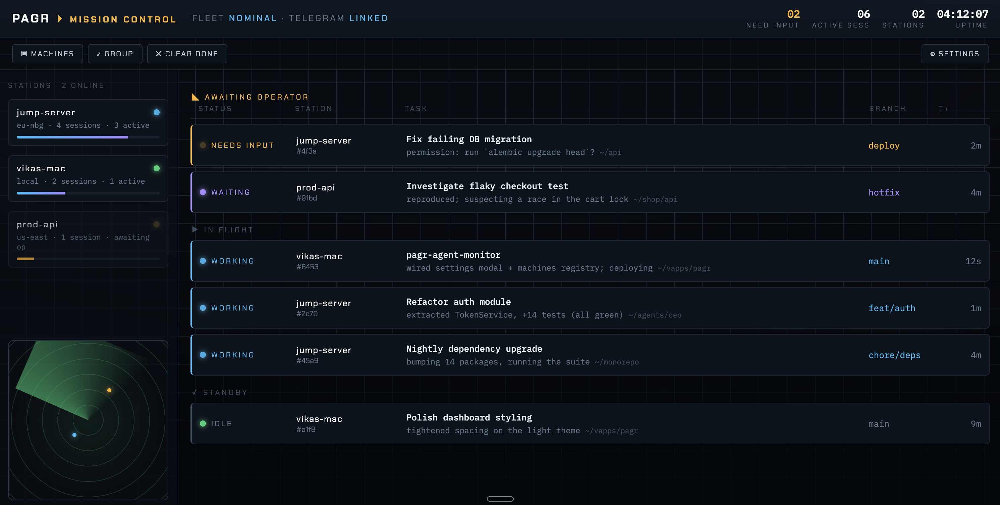

# pagr

One dashboard for every Claude Code agent you run — on this machine or any
remote SSH box — showing **Machine / Folder / Summary / Status**, with a
**Telegram** ping when an agent needs your input or has been left waiting.



It works by installing a tiny [hook](hooks/pagr-hook) on each machine that
POSTs Claude Code lifecycle events to a central service (hosted on InstaPods).

```
 each machine ──(Claude Code hooks)──▶ ~/.claude/pagr-hook ──HTTPS──▶ pagr ──▶ dashboard + Telegram
```

## Status model

| Hook event (matcher)               | Dashboard status | Telegram? |
|------------------------------------|------------------|-----------|
| `SessionStart`, `UserPromptSubmit` | working          | no        |
| `Notification` `permission_prompt` | needs input      | **yes**   |
| `Notification` `idle_prompt`       | waiting          | **yes**   |
| `Stop`                             | idle             | no¹       |
| `SessionEnd`                       | ended            | no        |

¹ `Stop` fires at the end of *every* turn, so pushing on it would be spam. Use
the ⚙ Settings toggle (or `NOTIFY_ON_STOP=1`) if you want a ping at every turn.

## Web UI

Open `https://pagr.sh/?key=<token>`:

- **Live board** — Machine / title / folder / summary / status, grouped by status or by machine (toggle).
- **Machines** — count + per-machine detail, plus a copy-paste one-liner to enroll a new box.
- **⚙ Settings** — configure the Telegram bot in the browser (token, chat ID, **Detect** chat ID, **Send test**); stored server-side, overrides env. So you don't have to set `TELEGRAM_*` via `instapods env`.
- **Clear done** — removes finished/idle sessions, plus working ones stale >1h.
- **Skins** — switch between **Clean** (light) and **Mission Control** (dark ops, station rail + radar) in ⚙ Settings, plus **list / grid** views for the feed. Early design explorations live in [`concepts/`](concepts/).

## Server (InstaPods)

```bash
cd pagr
instapods deploy pagr --preset python --plan launch
instapods env set pagr \
  PAGR_TOKEN=<secret> \
  TELEGRAM_BOT_TOKEN=<botfather-token> \
  TELEGRAM_CHAT_ID=<your-chat-id> \
  PAGR_DB=/home/instapod/pagr.db \
  PAGR_PUBLIC_URL=https://pagr.sh
instapods pods reload pagr
```

Open the dashboard at `https://pagr.sh/?key=<secret>`.

### Server env vars

| Var | Purpose |
|-----|---------|
| `PAGR_TOKEN` | shared secret for ingest + dashboard (required in prod) |
| `PAGR_DB` | SQLite path (keep it outside `/home/instapod/app` so deploys don't wipe it) |
| `TELEGRAM_BOT_TOKEN`, `TELEGRAM_CHAT_ID` | enable Telegram push |
| `PAGR_PUBLIC_URL` | dashboard URL included in Telegram messages |
| `NOTIFY_ON_STOP` | set to `1` to also push on every turn end |

## Enroll a machine

**One-liner — run it on the machine itself** (the pod serves the hook + installer):

```bash
curl -fsSL https://pagr.sh/enroll.sh | PAGR_TOKEN=<secret> bash -s -- --machine NAME
```

**Or push from your Mac over SSH** (no shell on the box needed):

```bash
hooks/install.sh --ssh user@host --machine NAME \
  --url https://pagr.sh --token <secret>
```

Either way it drops `~/.claude/pagr-hook` and merges an `env` + `hooks` block
into that machine's `~/.claude/settings.json` (existing settings preserved; a
`.pagr.bak` backup is kept). It only affects **new** Claude Code sessions
started afterward. `--machine` defaults to the hostname. See
[hooks/README.md](hooks/README.md) for prerequisites, verification, and removal.

## Run locally (dev)

```bash
python3 -m venv .venv && . .venv/bin/activate
pip install -r requirements.txt
uvicorn app:app --port 8000           # dashboard at http://localhost:8000  (no token => open)
```
